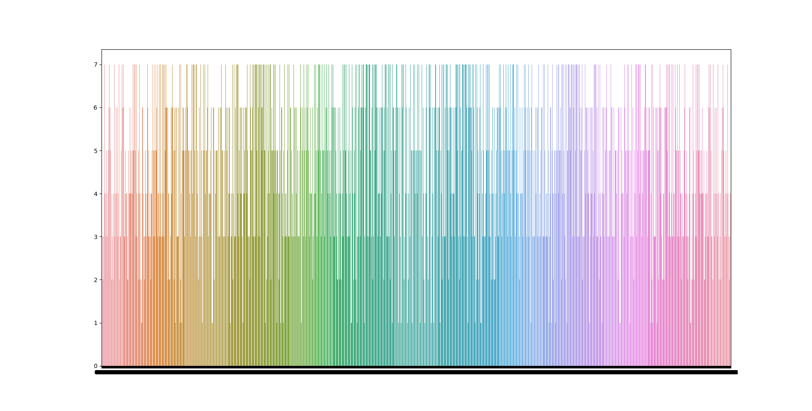

# Kaprekar's constant - 6174

## Harshad numbers

The constant 6174 is a very interesting number in the 4-digit world.

First off, it's a Harshad-number, which means that it's divisible by the sum of it's digits:

e.g.: 6174 / (6+1+7+4) = 343

## Kaprekar's procedure

Kaprekar discovered a procedure for 4 digit numbers that always ended up at 6174 in at most 7 iterations.

The only constraint is that it's only applicable to:

a. 4 digit numbers

b. Which have at least 2 different digits in them.

This means that the procedure works for 0001, but not for 1111.

The procedure is as follows:

1. Sort the digits from high to low as the first factor: 1000
2. Sort the digits from low to high for the second factor: 0001
3. Subtract the low factor from the high factor and pad back to 4 digits if necessary: 1000 - 0001 = 999 = 0999
4. Now repeat:
   
9990 - 0999 = 8991

9981 - 1899 = 8082

8802 - 0288 = 8514

8541 - 1458 = 7083

8730 - 0378 = 8352

8532 - 2358 = *6174*


So it took us 7 iterations to get from 0001 to 6174.

## I can haz codes?

The code below uses a recursive python function that verifies Kaprekar's procedure for all digits 0001-9998.

It subsequently renders a bar chart that plots every tested value and the number of iterations required.

This also proves rather quickly that we never need more than 7 iterations to arrive at the constant for each of the tested numbers.



Pretty cool stuff!

```python
from collections import defaultdict
from pprint import pprint
import seaborn as sns
import pandas as pd
import matplotlib.pyplot as plt

KAPREKARS_CONSTANT = 6174
iterset = set()
iterdict = defaultdict(list)


def add_padding(number):
    return f"{number:04}"

def generate_number():
    for i in range(0,10000):
        fs = add_padding(i)
        if not len(set(fs)) < 2:
            yield fs

def get_unique_count(st):
    return len(set(st))

def get_large_factor(number):
    return int(''.join(sorted(number, reverse=True)))

def get_small_factor(number):
    return int(''.join(sorted(number)))

def kaprekars_procedure(number, iter=None, starting_number=None):
    if iter is None:
        iter = 1
    if starting_number is None:
        starting_number = number

    big_number = get_large_factor(number)
    small_number = get_small_factor(number)

    result = big_number - small_number
    result = add_padding(result)

    if result != str(KAPREKARS_CONSTANT):
        iter += 1
        kaprekars_procedure(result, iter, starting_number)
    else:
        print(f"Solved sequence for {starting_number} to Kaprekar after {iter} iterations.")
        iterdict[starting_number].append(iter)
        iterset.add(iter)
        return iter


def main():
    for x in generate_number():
        kaprekars_procedure(x)

    dt = pd.DataFrame(iterdict)
    print(dt)
    sns.barplot(data=dt)
    plt.show()
main()
```

